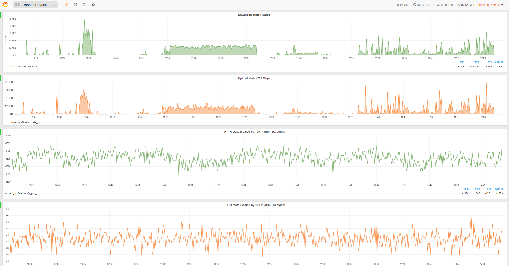

# freebox-monitoring
Simple Freebox Monitoring for anything able to load data in Influxdb or Graphite format.

Forked from [freebox-revolution-monitoring](https://github.com/tsugliani/freebox-revolution-monitoring)



Based/Inspired by https://github.com/tuxtof/freebox-monitoring

The newer freebox devices don't offer the hosted file with all the data information usually accessible here [`http://mafreebox.freebox.fr/pub/fbx_info.txt`](http://mafreebox.freebox.fr/pub/fbx_info.txt)

So this solution is leveraging the [Freebox API](http://dev.freebox.fr/sdk/os/) but just focuses on the stats I'm interested in, if you want to extend the script check all the other things available [here](http://dev.freebox.fr/sdk/os/connection/)


## Documentation

* **[Changelog](CHANGELOG.md)**
* **[Installation](doc/installation.md)**
* **[List of available metrics and tags](doc/output_metrics.md)**


## Command-line arguments

Available command-line switches and parameters:

```
SexiMonitor (0.8.0)

options:
  -h, --help            show this help message and exit
  -d, --debug           Activate the debug mode and print the retrieved data
  -c /path/to/file, --config /path/to/file
                        Full path to the credential file. Default is: <current directory>/.credentials
  -r, --register        Register the app with the Freebox API and cache the API url and version
  -s, --register-status
                        Get the registration status
  -f {graphite,influxdb}, --format {graphite,influxdb}
                        Specify output format between 'graphite' and 'influxdb'
  -e target-host, --endpoint target-host
                        Specify the dns or ip of the endpoint. Default is: mafreebox.freebox.fr
  --api-endpoint-detect-force
                        Ignore the cache and force the detection of the api capabilities from the endpoint target. Allow some overrides.
  --api-version-force version_major
                        Override the API major version and ignore the autodetection. Must be used with either '--register' or '--api-endpoint-detect-force'
  --ssl-no-verify       Disable the certificate validity tests on ssl connections
  --ssl-ca-bundle-file /path/to/file.pem
                        Full path to the custom ssl CA bundle file in PEM format. Both the root and intermediate certs must be present. Default is: <current directory>/ssl/free_telecom_bundle.pem
  -v, --version         Show the version and exit

  -C, --status-call     Get the phone call logs and history
  -X, --status-dhcp     Get and show the dhcp status
  -D, --status-disk, --internal-disk-usage
                        Get and show the disks status
  -B, --status-lan-browser
                        Get and show the hosts on the local network with the lan browser
  -L, --status-lte      Get and show 4G/LTE aggregation status
  -H, --status-sys      Get and show system status
  -P, --status-ports    DEPRECATED: has no effect, integrated into --status-switch and kept for compatibility
  -S, --status-switch   Get and show the switch and ports status
  -M, --status-virtualmachines
                        Get and show the virtual machines status
  -V, --status-vpnsrv   Get and show the VPN Servers status
  -Z, --status-vpnclient
                        Get and show the integrated VPN client status
  -W, --status-wifi     Get and show the Wifi status

```

**Notice:** using the parameter `--status-virtualmachines` on a system missing the virtualization capability will cause a 404 error.  
Also, the following parameters have not been fully tested and could not work completely: --status-virtualmachines, --status-vpnsrv, --status-lte, --status-disk


## Licence

[MIT](LICENSE)