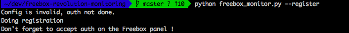
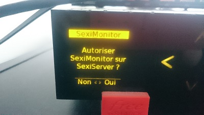
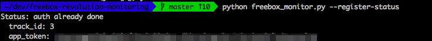
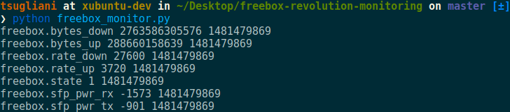
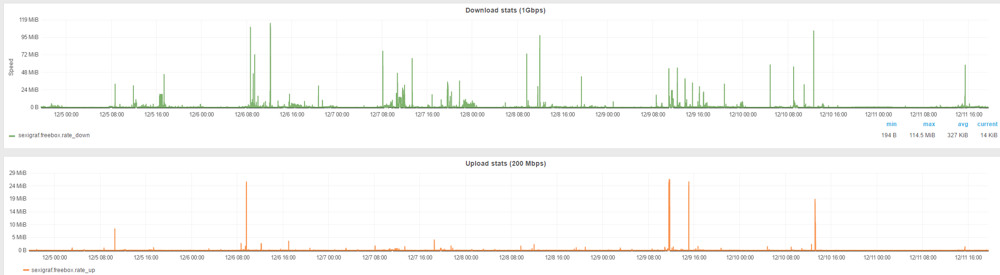
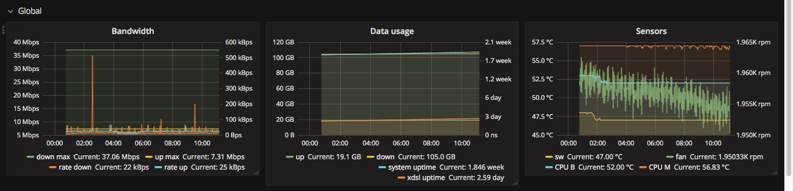
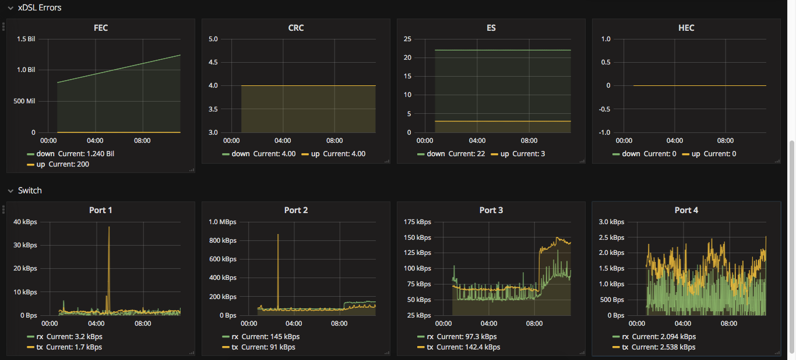

**freebox-monitoring**

# Installation steps

## Pre-requisites

This is what I used, you can of course adapt the collector script to talk to influxdb or whatever :-)

- [SexiGraf](http://www.sexigraf.fr) or any Grafana/Graphite stack
- [Telegraf](https://github.com/influxdata/telegraf)
- the following system packages installed : `apt-transport-https ca-certificates curl gnupg-agent software-properties-common`  
  (not necessary for docker)
- Python with `json` & `requests` libraries installed.
- Physical Access to the Freebox Server device.
- If using docker : docker-compose is suggested.

## Docker

The `docker-compose.env` contains the necessary parameters, covering :
- freebox monitoring parameters
- telegraf main configuration with influxdb and/or prometheus output
- influxdb target db configuration
- prometheus access configuration

The env file must be linked as `.env` using : `ln -s docker-compose.env .env`

The docker image must be build, with the standard command : `docker-compose build`  
Then start the container with : `docker-compose up -d `

Notice : the credential/configuration file is set as `/data/.credentials` in the container, with a volume attached to /data.  
Also, mind the `pull_policy` active in the docker-compose.yml file, which will have to be removed when using a private image registry.

# Usage

## Step 1: Register an app with the Freebox device

First thing to do is to register an app, to generate a specific `freebox_app_token`.

Run `python freebox_monitoring.py --register [-e freebox-endpoint]` to do that.
If running docker,  start the container with `docker-compose up -d` , the registration mode will be triggered by the missing credential file. The state can be seen in the docker logs.

* Notice: You can specify the `-e endpoint` (Freebox name or address) to allow multiple endpoints (Optional)*
* Notice: When not using docker, to prevent any trouble with future updates, it is heavily suggested to move manually the credential / configuration file,  
  then add the following parameter to call the script : `--config /path/to/.credentials`

Once you execute this script, you will see something similar to this:



Head to your Freebox Server device.



Press the `>` to authorize the app registration process.

You can check the saved tokens with `python freebox_monitor.py --register-status`:



If you need to re-auth you can delete the authorization credentials by removing the file `.credentials` in the directory where `freebox_monitor.py` is.
For docker, simply remove the `fbmonit_fbm-data` volume, it will be recreated at the next start


## Step 2: Use the script to display freebox statistics information

Once you have your `freebox_app_token`, the process to authenticate happens in 2 steps:
- Fetch the current `challenge`. (basically a random generated string changing over time)
- Compute a `session password` with the `challenge` and your `freebox_app_token`.

This is done automatically, and will avoid sending the token each over the network.

Then execute the script, to make sure it connects and displays information.




## Step 3: Stats to get and show

By default the script will auto adapt beetween FFTH and xDSL.

Without any extra parameters, the following metrics will be retrieved : 
  * FFTH and xDSL (no switch, default)
    * bytes up/down
    * rate up/down
    * bandwidth up/down
    * connection state
    
  * FTTH
    * sfp power rx/tx
  
  * xDSL (each for up, and down, except uptime)
    * uptime
    * errors: es, hec, crc, ses, fec
    * rate, attenuation, signal noise ratio, max rate
    * G.INP status, corrected and uncorrected

For more, see the integrated help (or the main readme page), and the full list of [available metrics and tags](output_metrics.md).  

When using docker, update the parameter `FB_MONITOR_ARGS` in the `docker-compose.env` file to activate additional metrics.


## Step 4: Leverage telegraf to call the script and send stats to InfluxDB

**Installation only when not using Docker**

Install telegraf on the SexiGraf appliance (adjust the version as required).

```console
wget https://repos.influxdata.com/debian/packages/telegraf_1.24.4-1_amd64.deb
dpkg -i telegraf_1.24.4-1_amd64.deb
```

Generate a config file for our plugins `exec` and `influxdb`.

```console
telegraf --input-filter exec --output-filter influxdb config > /etc/telegraf/telegraf.conf
```

Check & edit the configuration file to make it look as follows:

```ini
###############################################################################
#                            OUTPUT PLUGINS                                   #
###############################################################################

# Configuration for sending metrics to InfluxDB
[[outputs.influxdb]]
  ## The full HTTP or UDP URL for your InfluxDB instance.
  ##
  ## Multiple URLs can be specified for a single cluster, only ONE of the
  ## urls will be written to each interval.
  urls = ["http://influxdb.domain.tld:8086"]

  ## The target database for metrics; will be created as needed.
  ## For UDP url endpoint database needs to be configured on server side.
  database = "freebox"

  ## If true, no CREATE DATABASE queries will be sent.  Set to true when using
  ## Telegraf with a user without permissions to create databases or when the
  ## database already exists.
  skip_database_creation = true

  ## Write consistency (clusters only), can be: "any", "one", "quorum", "all".
  ## Only takes effect when using HTTP.
  write_consistency = "any"

  ## Timeout for HTTP messages.
  timeout = "30s"

  ## HTTP Basic Auth
  username = "influxdb db user"
  password = "influxdb db password"

  ## HTTP User-Agent
  user_agent = "telegraf-fbmonitor"


###############################################################################
#                            INPUT PLUGINS                                    #
###############################################################################

# Read metrics from one or more commands that can output to stdout
[[inputs.exec]]
  ## Commands array
  command = [
     "/usr/local/freebox-revolution-monitoring/freebox_monitor.py --config /path/to/file/.credentials --format influxdb --endpoint freebox_custom_address"
  ]

  ## Timeout for each command to complete.
  timeout = "15s"

  ## Data format to consume.
  ## Each data format has it's own unique set of configuration options, read
  ## more about them here:
  ## https://github.com/influxdata/telegraf/blob/master/docs/DATA_FORMATS_INPUT.md
  data_format = "influx"
```

Copy your modified `freebox_monitor.py` script to `/usr/local/freebox-monitoring/`

Adjust the access rights to the credential file to allow Telegraf 

```console
chgrp telegraf /path/to/file/.credentials
```


Relaunch telegraf and check the logs

```console
tail -f /var/log/telegraf/telegraf.log
```

As long as the output is empty, telegraf did not encounter any error.  
You should be good to go and build your own dashboards in SexiGraf.

Here is a 2 day view of the download/upload stats.



Example of the xDSL graphs




Enjoy !
